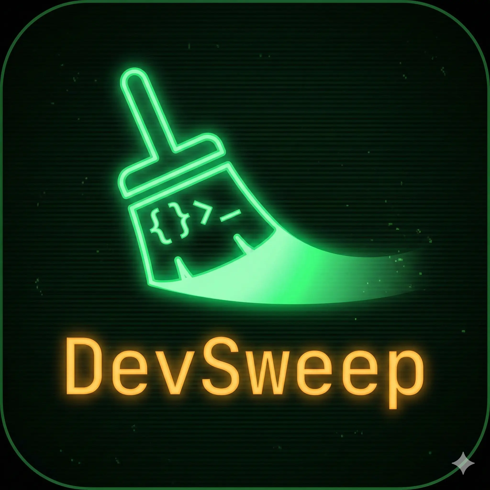

<div align="center">
  
  
  # DevSweep
  
  **Professional macOS developer cache cleaner**
  
  _Reclaim gigabytes of disk space safely and intelligently_

  [](https://opensource.org/licenses/MIT)
  [](https://www.gnu.org/software/bash/)
  [](https://www.apple.com/macos/)
  [](https://github.com/Sstark97/dev_sweep/actions/workflows/test.yml)
</div>

---

## 🎯 Overview

DevSweep is a **production-grade CLI tool** that safely cleans deep system caches on macOS, helping developers reclaim valuable disk space without compromising system stability.

### 📺 See It In Action

<div align="center">
  
  <p><em>DevSweep analyze mode detecting ~14GB of cleanable caches</em></p>
</div>

### 🧹 What It Cleans

- **🎨 JetBrains IDEs** - Removes old versions, keeps latest, cleans corrupted caches (~2-5GB)
- **🐳 Docker/OrbStack** - Containers, images, volumes, and build cache (~5-20GB)
- **🍺 Homebrew** - Old package versions, unused dependencies, download cache (~500MB-2GB)
- **⚙️ Dev Tools** - Maven, Gradle, npm, yarn, pnpm, pip caches (~5-15GB)
- **🗂️ System** _(Coming soon)_ - System logs and caches

**Average recovery**: 10-30GB of disk space

## ✨ Features

- 🛡️ **Safety First**: Built-in `--dry-run` and `--analyze` modes to preview all actions
- 🎛️ **Interactive Menu**: User-friendly interface for guided cleanup
- 🔧 **Modular Architecture**: Clean, testable, extensible codebase
- ⚠️ **Double Confirmation**: Explicit approval for destructive operations
- 📊 **Smart Analysis**: Shows estimated space to be recovered before cleaning
- 🎨 **Beautiful Output**: Colored, organized logging with progress indicators
- ✅ **Well Tested**: 115 tests, 100% passing, optimized for speed
- 🚀 **Fast**: Optimized for performance, completes in seconds

## 📦 Installation

### Homebrew (Recommended)

```bash
# Add the tap
brew tap sstark97/tap

# Install DevSweep
brew install devsweep
```

### Quick Install (Alternative)

```bash
# Clone and install locally (no sudo required)
git clone https://github.com/Sstark97/dev_sweep.git
cd dev_sweep
make install-local

# Verify installation
devsweep --version
```

The command will be available at `~/.local/bin/devsweep`

### System-wide Installation

```bash
git clone https://github.com/Sstark97/dev_sweep.git
cd dev_sweep
sudo make install

# Available globally
devsweep --version
```

### Uninstall

```bash
# Homebrew
brew uninstall devsweep
brew untap sstark97/tap

# Local installation
make uninstall-local

# System-wide
sudo make uninstall
```

## 🚀 Usage

### Quick Start

```bash
# Interactive mode - guided cleanup
devsweep

# Analyze mode - see what can be cleaned with size estimates
devsweep --analyze --all

# Safe preview - see detailed actions without deleting
devsweep --dry-run --all

# Clean everything (with confirmations)
devsweep --all
```

### Interactive Mode

```bash
devsweep
```

Launches an interactive menu to select which modules to run.

### Command-Line Flags

```bash
# Analyze mode - preview with size estimates (recommended first step)
devsweep --analyze --all

# Run all cleanup modules (with confirmations)
devsweep --all

# Safe preview mode - see detailed actions, no files deleted
devsweep --dry-run --all

# Clean specific modules
devsweep --jetbrains
devsweep --docker --homebrew

# Skip confirmations (use with caution!)
devsweep --force --all

# Verbose output
devsweep --verbose --jetbrains
```

### Available Flags

| Flag | Short | Description |
|------|-------|-------------|
| `--help` | `-h` | Show help message |
| `--version` | `-v` | Show version |
| `--analyze` | `-a` | Analyze and show cleanup preview with size estimates |
| `--dry-run` | `-d` | Preview mode - shows detailed actions, no deletions |
| `--verbose` | | Detailed output |
| `--force` | `-f` | Skip confirmations |
| `--all` | `-a` | Run all cleanup modules |
| `--jetbrains` | | Clean JetBrains IDEs only |
| `--docker` | | Clean Docker/OrbStack only |
| `--homebrew` | | Clean Homebrew only |
| `--devtools` | | Clean dev tools (Maven, Gradle, Node) |
| `--system` | | Clean system caches and logs |

### Examples

```bash
# Recommended workflow: Analyze first, then clean
devsweep --analyze --all          # See what can be cleaned
devsweep --all                     # Clean with confirmations

# Safe exploration - see detailed actions
devsweep --dry-run --all

# Clean only JetBrains with preview
devsweep --jetbrains --verbose

# Full cleanup of dev tools
devsweep --devtools --docker --homebrew

# Clean everything (skip confirmations - use with caution!)
devsweep --force --all
```

## 🛡️ Safety Features

1. **� Analyze Mode**: Preview what can be cleaned with size estimates before any action
2. **🔍 Dry-Run Mode**: See detailed actions without making changes
3. **✋ Interactive Confirmations**: Explicit approval for destructive operations
4. **🔒 Smart Validation**: Prevents accidental deletion of critical paths
5. **📝 Detailed Logging**: Full transparency of all actions taken
6. **💾 Version Preservation**: Automatically keeps latest IDE versions
7. **⚡ Graceful Handling**: Safely handles missing tools and empty caches

## 💻 Development

### Prerequisites

- macOS 10.15+
- Bash 5.0+
- [bashunit](https://github.com/TypedDevs/bashunit) 0.32.0+ for testing

### Setup

```bash
# Clone repository
git clone https://github.com/Sstark97/dev_sweep.git
cd dev_sweep

# Install dependencies
make setup

# Run tests
make test
```

### Running Tests

```bash
# Run all tests (123 tests, ~12.2s)
make test

# Run specific test suite
./bashunit tests/unit/jetbrains_test.sh

# Watch mode (requires fswatch)
make watch-test
```

### Make Commands

```bash
make help              # Show all available commands
make test              # Run all tests
make lint              # Run shellcheck
make check             # Syntax validation
make install-local     # Install locally
make clean             # Remove temporary files
```

### Project Structure

```
dev_sweep/
├── bin/
│   └── devsweep              # Main entry point
├── src/
│   ├── modules/              # Cleanup modules
│   │   ├── jetbrains.sh      # JetBrains IDE cleanup
│   │   ├── docker.sh         # Docker/OrbStack cleanup
│   │   ├── homebrew.sh       # Homebrew cleanup
│   │   └── devtools.sh       # Dev tools cleanup
│   └── utils/                # Shared utilities
│       ├── config.sh         # Configuration
│       ├── common.sh         # Common functions
│       └── menu.sh           # Interactive menu
├── tests/
│   ├── unit/                 # Unit tests (112 tests)
│   └── e2e/                  # E2E tests (11 tests)
├── Makefile                  # Build automation
└── .bashunit.yml             # Test configuration
```

## 🔄 For Maintainers

### Branch Protection Setup

To enforce code quality, configure branch protection rules for the `main` branch:

1. Go to **Settings** → **Branches** → **Branch protection rules**
2. Click **Add rule** for `main` branch
3. Configure the following settings:
   - ✅ **Require a pull request before merging**
   - ✅ **Require status checks to pass before merging**
     - Add required check: `test` (from Tests workflow)
   - ✅ **Require branches to be up to date before merging**
   - ✅ **Do not allow bypassing the above settings** (recommended)

This ensures that all PRs must pass the automated test suite before they can be merged.

### Creating a Release

```bash
# Complete automated release workflow
make publish VERSION=1.0.0
```

This command:
1. ✅ Runs all tests
2. ✅ Creates release tarball
3. ✅ Creates and pushes git tag
4. ⏸️ Pauses for GitHub release creation
5. ✅ Updates Homebrew formula with correct SHA256
6. ✅ Validates everything is ready

See [QUICKSTART_RELEASE.md](QUICKSTART_RELEASE.md) for details.

### Publishing to Homebrew

After creating a release, submit to Homebrew Core:

```bash
# Fork and clone homebrew-core
git clone https://github.com/YOUR_USERNAME/homebrew-core.git
cd homebrew-core

# Add formula
git checkout -b devsweep
cp ../dev_sweep/devsweep.rb Formula/devsweep.rb

# Test and submit
brew install --build-from-source Formula/devsweep.rb
brew test devsweep
brew audit --strict --online Formula/devsweep.rb

git add Formula/devsweep.rb
git commit -m "devsweep 1.0.0 (new formula)"
git push origin devsweep
```

See [HOMEBREW_CORE_SUBMISSION.md](HOMEBREW_CORE_SUBMISSION.md) for complete guide.

## 📊 Test Coverage

```
Tests:      123 passed, 123 total
  Unit:     112 tests (fast validation, <50ms each)
  E2E:      11 tests (integration validation)
    Smoke:  3 critical tests (CLI, menu, analyze)
    Cleanup: 8 tests (module behavior)
Time:       ~12.2 seconds (parallel execution)
Coverage:   All modules tested, following testing pyramid
```

## 🔮 Roadmap

- [ ] Add more modules (Xcode, Gradle)
- [ ] Windows Support: Planning a rewrite in .NET 10 Native AOT for cross-platform compatibility
- [ ] MCP Server Integration (AI Agent Support) - Planned for v2 (.NET)


## 🤝 Contributing

Contributions are welcome! Please read [CONTRIBUTING.md](CONTRIBUTING.md) for:
- Code style guidelines
- Testing requirements
- Pull request process
- Development workflow

## 📄 License

MIT License - see [LICENSE](LICENSE) for details.

## 🙏 Acknowledgments

- Built with [bashunit](https://github.com/TypedDevs/bashunit) for professional testing
- Follows Clean Code principles and modern bash best practices
- Inspired by the need to reclaim disk space on developer machines

## 📚 Documentation

- [QUICKSTART.md](QUICKSTART.md) - Quick start guide
- [QUICKSTART_RELEASE.md](QUICKSTART_RELEASE.md) - Release workflow guide
- [HOMEBREW_CORE_SUBMISSION.md](HOMEBREW_CORE_SUBMISSION.md) - Homebrew publishing guide
- [CONTRIBUTING.md](CONTRIBUTING.md) - Contribution guidelines

## 🔗 Links

- **Repository**: https://github.com/Sstark97/dev_sweep
- **Issues**: https://github.com/Sstark97/dev_sweep/issues
- **Releases**: https://github.com/Sstark97/dev_sweep/releases

---

<div align="center">
  
  **Made with ❤️ by developers, for developers**
  
  If DevSweep saved you disk space, give it a ⭐!

</div>

Next steps for Homebrew Core:
  1. Fork: https://github.com/Homebrew/homebrew-core
  2. Copy formula: cp devsweep.rb <homebrew-core>/Formula/
  3. Commit: git commit -m 'devsweep 1.0.0 (new formula)'
  4. Create PR to Homebrew/homebrew-core